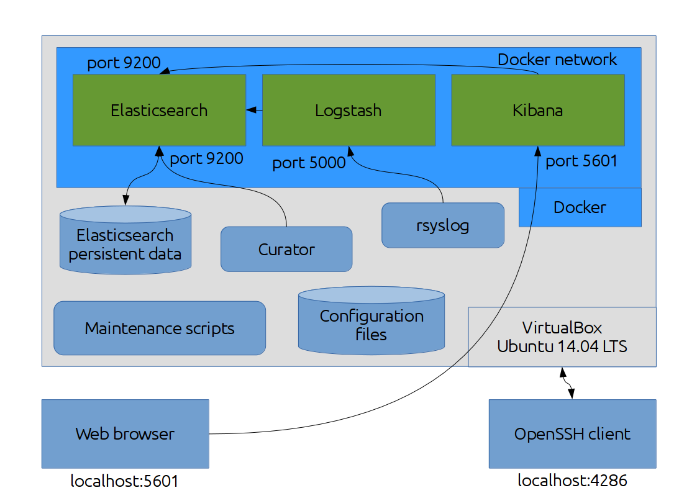

# How everything works together

This will give us an insight about how Dockerific ELK stack runs on a VirtualBox guest machine.



We can see that we have a VirtualBox guest machine that holds the Ubuntu Server 14.04 LTS. Accessing it is done thorough the VirtualBox graphical interface (not very convenient, so we will not utilize this) and through OpenSSH (very convenient and useful).

The guest machine is set to expose port `5601` for accessing the Kibana instance, and `4286` for connecting to the machine through OpenSSH, all to be utilized by the host machine only. I have chosen `4286` because I already have an OpenSSH daemon running on my host machine on port `22`, and this way we avoid confusion.

Inside the guest machine there is the Docker daemon running, and the three instances of Elasticsearch, Kibana and Logstash are started in parallel using Docker Compose, all on the same Docker network.

The `maintenance/setup` script sets the guest machine's `rsyslog` server to send the system log messages through TCP port `5000` to whomever connects to it, and since it works within the guest environment, it is all right. In case we want to use this on a production machine, we need to edit the `/etc/rsyslog.d/99-emit-logs.conf` file and set the correct server name, for example:

```
*.*         @@some_machine:5000
```

Also, the `maintenance/setup` script sets a `sysctl` tunable through the file `/etc/sysctl.d/99-increase-max-map-count.conf` to increase the limit of the maximum number of memory-mapped areas to `262144` and avoid Elasticsearch's complaints and conform to it's stringent checks.

The configuration files of the three services are mounted as volumes, to ease reconfiguration and avoid creating new layers of the Docker images, thus optimizing their size.

Elasticsearch's data must be persistent (to preserve indices and shards), so that's why the `data` directory is mounted as a volume, too. All syslog data that is received is stored and indexed by Elasticsearch.

Once Logstash starts, it will listen on port `5000`, wait for `rsyslog` to send system logs, and forward all of them to Elasticsearch's port `9200`.

Kibana will start and open port `5601` so we can use a web browser to access the web interface and analyze data. Kibana connects to Elasticsearch's port `9200` to retrieve this information.

Curator connects to a running instance of Elasticsearch on port `9200` to remove indices older than 30 days. It runs as a `cron` job.

A `cron` job automates backups of Elasticsearch's data volume every midnight on every Sunday. It only works if Elasticsearch is not running, to avoid data corruption, and only if the backup mount point `/mnt/backups` is available.

Also, a `cron` job will check for free disk space on all mount points every 5 minutes and alert the administrator in case any has 5% free space left or less. 

That's all, folks!
